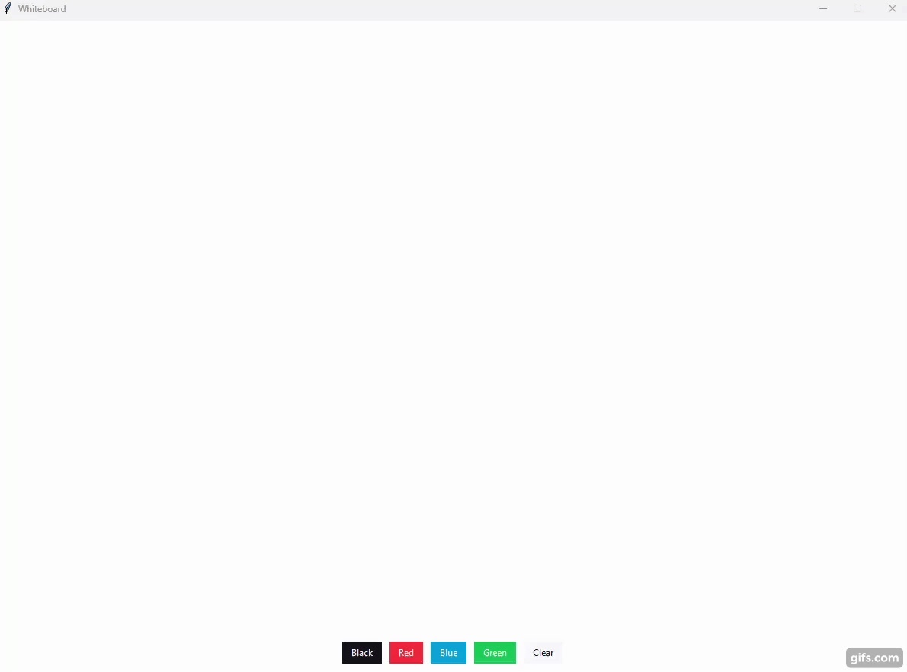

# Simple Whiteboard

Simple Whiteboard app made with tkinter and ttkbootstrap.

App was made following [this](https://www.youtube.com/watch?v=EEL5Th9C3wo&t=1s&ab_channel=AlinaChudnova) tutorial made by youtuber Alina Chudnova.

### Features

- Draw with pen
- Change pen color
- Clear canvas

## Demo

## Requirements
- Python 3+
- ttkbootstrap

## Usage

1. Run 'python main.py'